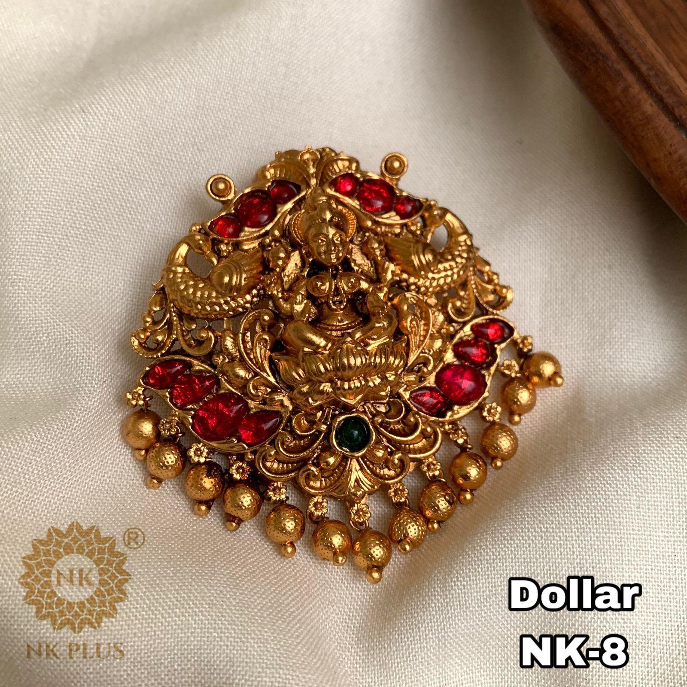

# Bilvashree Jewels


## Overview

Bilvashree Jewels is a premium e-commerce platform offering meticulously handcrafted South Indian temple jewellery. Rooted in devotion and heritage, our collection features elegant pendants, necklaces, harams, earrings, bangles, and accessories designed for various occasions from daily wear to bridal collections.

Each piece is thoughtfully crafted by skilled artisans using responsible sourcing and sustainable practices, aiming to provide a touch of divine artistry.

## Key Features

- **Extensive Catalog:** Browse a diverse range of over 40 unique handcrafted products.
- **Categorized Shopping:** Filter products by categories like Necklaces, Harams, Pendants, Earrings, Bangles, and Accessories.
- **Occasion-Based Shopping:** Quickly find pieces suitable for Bridal, Festive, Party, Office, or Daily wear.
- **Seamless Cart Experience:** Keep track of selected items and calculate shipping milestones.
- **Direct Checkout:** Initiate orders directly via WhatsApp or Email.
- **Responsive Design:** Optimized for both desktop and mobile viewing with a beautifully animated interface.



## Tech Stack

- **Framework:** Next.js (v14.2.3)
- **Library:** React (v18)
- **Styling:** CSS
- **Utilities:** Tesseract.js (for product categorization from catalog images)

## Project Structure

- `app/`: Next.js application routing and main page layouts (`page.js`, `layout.js`).
- `data/`: Contains static inventory definitions, product lists, categories, and promotions (`inventory.js`, `products.js`, `products_summary.json`).
- `public/`: Static assets, primarily holding the collection of product images organized by categories.
- `Python Scripts`: Contains utilities to automate the extraction and categorization of product images using OCR (`categorize_images.py`, `extract_pdf.py`).

## Getting Started

### Prerequisites

Ensure you have [Node.js](https://nodejs.org/) installed on your machine.

### Installation

1. Clone the repository:
   ```bash
   git clone <repository-url>
   cd bilvashree-jewels
   ```

2. Install dependencies:
   ```bash
   npm install
   ```

### Running Locally

To start the development server:

```bash
npm run dev
```

Open [http://localhost:3000](http://localhost:3000) with your browser to see the result.

### Building for Production

To create an optimized production build:

```bash
npm run build
```

To start the production server:

```bash
npm run start
```

## Contributing

Contributions, issues, and feature requests are welcome!

## License

© 2026 Bilvashree Jewels. All rights reserved. Crafted with devotion.
